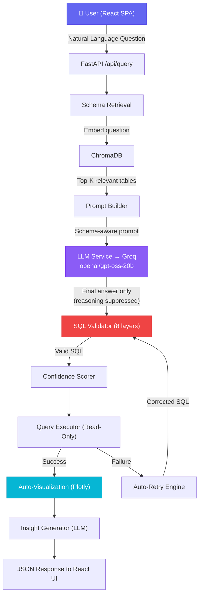
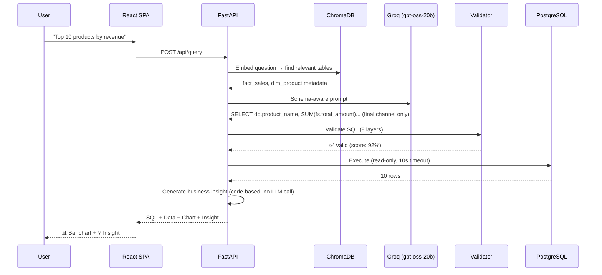
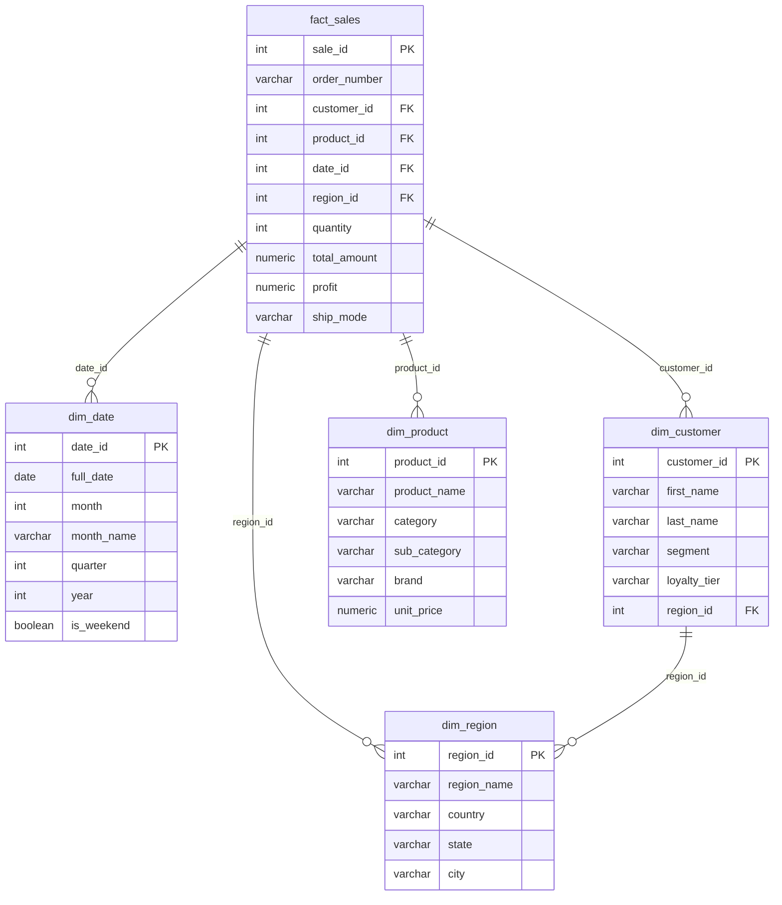

# Architecture Documentation

## System Architecture Diagram

## Data Flow

## Database Star Schema

## Security Architecture

| Layer | Protection |
|-------|-----------|
| SQL Validation | SELECT-only, blocked DDL/DML, injection pattern detection |
| LIMIT Enforcement | Auto-adds LIMIT, caps at 1000 rows |
| Read-Only DB User | `bi_readonly` role with SELECT-only privileges |
| Statement Timeout | 10-second PostgreSQL timeout per query |
| Schema Validation | Rejects queries referencing unknown tables/columns |
| Input Sanitization | sqlparse structural validation, stacked query rejection |
